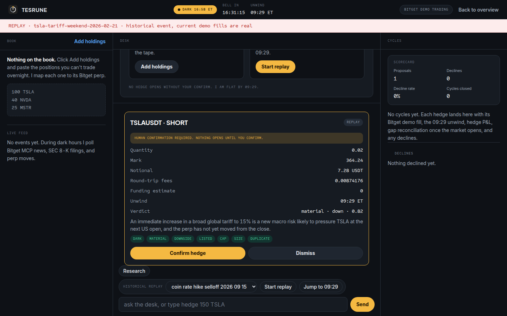

<p align="center">
  
</p>

<h1 align="center">Tesrune</h1>

<p align="center"><strong>Hold the stock. Hedge the dark hours. Flat by the bell.</strong></p>

<p align="center">
  <a href="https://github.com/mystiquemide/tesrune/actions/workflows/ci.yml"></a>
  
  
  <a href="LICENSE"></a>
</p>

<p align="center">
  <a href="https://tesrune.midelabs.xyz">Landing</a> ·
  <a href="https://tesrune.midelabs.xyz/desk">Demo desk</a> ·
  <a href="https://t.me/tesrune_desk_bot">Telegram alerts</a> ·
  <a href="docs/EVIDENCE.md">Evidence</a>
</p>

> **Track:** AI Trading Desk · Open Theme  
> **Built with:** Bitget Stock Perpetuals · Bitget Demo Trading · Bitget MCP · Qwen 3.8 Max · Agent Hub optional  
> **Core idea:** Tesrune watches US stocks held at a closed broker, proposes bounded same-name hedges during dark hours, requires human confirmation, and unwinds every confirmed hedge before the opening bell.

<p align="center">
  
</p>

Tesrune is a dark-hours hedging desk for US stocks held at a broker that is closed. It watches held names, evaluates material overnight events, proposes a same-name hedge on Bitget stock perpetuals, waits for human confirmation, and schedules every opened hedge to unwind by 09:29 ET before the US cash session opens.

Built for Bitget AI Hackathon S2.

## The problem

Your stock position stays open when your broker does not.

A company filing, policy headline, or sharp market move can land after the broker closes or during the weekend. The underlying position remains exposed, but the trader cannot reduce it until the broker reopens.

Tesrune uses Bitget's 24/7 stock perpetuals as a temporary hedge venue during that gap.

The invariant is simple:

> Every hedge is bounded by the held stock quantity, requires human confirmation, and is flat by the bell.

## How it works

1. **Book**: paste the US stock holdings you cannot trade overnight. Qwen parses them, you confirm, and Tesrune resolves each supported name to its Bitget stock perp.
2. **Event**: during dark hours the desk polls Bitget MCP news, SEC EDGAR 8-K filings, and relevant perp price moves.
3. **Interpret**: Qwen 3.8 Max classifies the event as material, priced, or noise, with direction, confidence, and a short reason.
4. **Mandate**: deterministic rules decide whether a hedge may exist and cap its size. Qwen never sizes an order.
5. **Human confirm**: a valid proposal is shown on the desk. Nothing opens until the user clicks Confirm hedge.
6. **Bitget demo execution**: the signed proposal is sent to Bitget demo trading, which returns a real demo-engine fill using virtual funds.
7. **09:29 unwind**: the scheduler closes the hedge before the opening bell and verifies the position is flat. The schedule re-arms after a restart.

```text
Held stock book
      |
      v
Dark-hours events
Bitget MCP + SEC + perp moves
      |
      v
Qwen 3.8 Max
materiality + direction only
      |
      v
Deterministic mandate
dark hours + material + downside + listed + delta cap + min size + duplicate guard
      |
      v
Human confirmation
      |
      v
Bitget demo fill
      |
      v
Scheduled 09:29 ET unwind
      |
      v
Cycle log + reconciliation + scorecard
```

## Execution boundary

| Layer | Responsibility | Can place an order? |
| --- | --- | --- |
| Qwen 3.8 Max | Interpret event materiality and direction | No |
| Mandate engine | Enforce deterministic rules, cap size, stamp valid proposals | No |
| Human | Review and confirm a valid proposal | Authorizes |
| Execution boundary | Verify the mandate stamp and place the Bitget demo order | Yes |
| Unwind scheduler | Close confirmed hedges by 09:29 ET and verify flat | Close only |

If Qwen is unavailable, a rules fallback can classify events and every resulting card is explicitly labeled `source: rules`.

## Why Bitget is load-bearing

Tesrune depends on Bitget for the core product loop:

- **Stock perpetuals** provide the 24/7 same-name hedge instrument while the external stock broker is closed.
- **Demo trading** provides real order placement and fills with virtual funds, so the execution path is exercised rather than simulated with local paper math.
- **Bitget MCP** supplies US stock news, quotes, and historical data used by the research and replay paths.
- **Agent Hub** is an optional flag-gated live account route. The hackathon proof path uses demo trading.

Remove the stock perps and the dark-hours hedge disappears.

## Demo path, under three minutes

1. Open the [demo desk](https://tesrune.midelabs.xyz/desk).
2. Choose the TSLA weekend tariff replay and click **Start replay**.
3. Inspect Qwen's material-down decision and the deterministic proposal.
4. Click **Confirm hedge**. Only now does Tesrune place the Bitget demo order.
5. Click **Jump to 09:29** to run the scheduled unwind and verify the position is flat.
6. Inspect **Cycles** for the open order, close order, hedge P&L, and status.
7. Run the COIN replay to see the refusal path. Qwen classifies the event as already priced and Tesrune records a `NOT_MATERIAL` decline without placing an order.

The replay UI keeps historical counterfactual evidence separate from current Bitget demo fills.

## Verified evidence

The current suite contains **83 tests**, covering the market clock, book parsing, event feeds, Qwen materiality handling, mandate rules, mandate stamps, demo execution, replay paths, unwind and restart recovery, gap reconciliation, desk state, Telegram alerts, and proxy sizing.

CI runs on Node 22 for every push and pull request to `master`:

```bash
node --test 'test/*.test.mjs'
```

The evidence log includes verified Bitget demo order IDs, full open-to-flat cycles, the TSLA material proposal path, the COIN priced-decline path, historical candle ranges, and explicit limitations.

See [docs/EVIDENCE.md](docs/EVIDENCE.md) for the full record.

## Additional capabilities

- **Post-open reconciliation**: once the US cash session opens, Tesrune can compare the verified stock open against the hedged shares and calculate the portion of the gap offset by the hedge. Until then the field remains pending, never guessed.
- **Hedge scorecard**: proposals, declines, decline rate, closed cycles, net hedge P&L, event-to-proposal latency, and hedge offset are aggregated from logged records.
- **Live feed**: incoming Bitget MCP news, SEC 8-K filings, and perp moves are shown with their model verdicts.
- **Telegram alerts**: anyone can connect [@tesrune_desk_bot](https://t.me/tesrune_desk_bot) with `/start`. The bot alerts when a hedge is ready or an unwind fails, then links back to the desk. It never executes.
- **Index proxy hedge**: optional beta-sized correlation hedging for a held name with no same-name Bitget perp. It is clearly labeled as a proxy with basis risk and is off by default.
- **Replay library**: real historical scenarios cover both a material-down proposal and an already-priced decline.

## Run locally

Tesrune requires Node 22 and has no package install step.

```bash
git clone https://github.com/mystiquemide/tesrune.git
cd tesrune
cp .env.example .env
```

Configure the required values:

| Variable | Purpose |
| --- | --- |
| `BITGET_PAPER_API_KEY` | Bitget demo-trading API key |
| `BITGET_PAPER_SECRET_KEY` | Bitget demo-trading secret |
| `BITGET_PAPER_PASSPHRASE` | Bitget demo-trading passphrase |
| `BITGET_QWEN_API_KEY` | Qwen hackathon API key |
| `QWEN_BASE_URL` | OpenAI-compatible Qwen endpoint |
| `QWEN_MODEL` | Defaults to `qwen3.8-max` |
| `TESRUNE_MANDATE_SECRET` | 32+ character secret used to sign mandate stamps |
| `EDGAR_USER_AGENT` | Descriptive SEC EDGAR user agent |

Optional:

| Variable | Purpose |
| --- | --- |
| `TELEGRAM_BOT_TOKEN` | Enables the Telegram alert bot |
| `TELEGRAM_CHAT_ID` | Optional operator chat seeded into the subscriber list |
| `TESRUNE_PUBLIC_URL` | Public desk URL used in Telegram deep links |
| `TESRUNE_PROXY_HEDGE=1` | Enables the index-proxy hedge path |
| `TESRUNE_LIVE=1` | Enables the optional flag-gated live Agent Hub path |

Start the desk:

```bash
node --env-file=.env src/desk.mjs
```

Then open:

- Landing: `http://127.0.0.1:4310`
- Desk: `http://127.0.0.1:4310/desk`

Run the tests:

```bash
node --test 'test/*.test.mjs'
```

## Repository map

```text
public/       landing page and desk UI
src/          book, feeds, materiality, mandate, execution, replay, unwind, alerts
scenarios/    historical replay fixtures
test/         Node test suite
docs/
  ARCHITECTURE.md
  DESIGN.md
  EVIDENCE.md
```

## Limitations

- Holdings are self-reported. Tesrune does not verify positions at the external broker.
- Demo execution uses virtual funds on Bitget's demo engine. It is not a live-money account.
- Historical replay pricing uses real candle ranges where exact historical perp fills are unavailable. Those ranges are not presented as exact fills.
- Underlying gap P&L remains pending until a post-open quote is verified.
- Calm dark windows can produce no proposal. Tesrune records that outcome and places no order.
- Proxy hedges carry basis risk and are disabled by default.

## License

Tesrune is released under the [MIT License](LICENSE).
